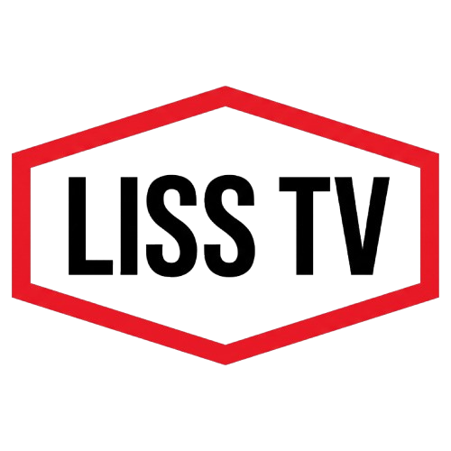
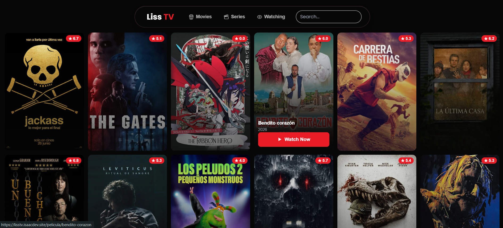

# Liss TV

Plataforma de streaming de contenido de video para películas y series, sin anuncios y con experiencia similar a una plataforma de streaming premium. Creado con Nextjs, Tailwind CSS, vidstack, etc.

## Instalación

Instala las dependencias del proyecto:

```bash
npm install
```

Levanta el proyecto en modo desarrollo:

```bash
npm run dev
```

Levanta el proyecto en modo producción:

```bash
npm run build
npm run start
```

NOTA: Se debe tener el servicio de Tor corriendo para que la aplicación funcione correctamente.

## Servicio de Tor

```bash
docker run -d --name tor-proxy -p 9050:9050 dperson/torproxy
```

## Instalacion con Docker

```bash
docker-compose up -d
```

```bash
docker run --name liss-tv -p 8000:8000 -d epmyas2022/liss-tv:latest
```

## Example


